<div align="center">

<a href="https://git.io/typing-svg"></a>

<p align="center">
  
  
  
  
  
  
</p>

**Course**: CO543 / CO5430 — Computer Vision <br>
**Project Track**: Application (Transport) + Model/Method (Object Detection) <br>
**Period**: 1 July 2026 – 7 September 2026

<a href="https://github.com/SajithK203/Traffic-Sign-Detection/stargazers"></a>
<a href="https://github.com/SajithK203/Traffic-Sign-Detection/network/members"></a>

</div>

---

## 🧩 Problem Statement

This project builds a system that takes an **image or video frame** as input and produces the **location (bounding box)** of every traffic sign in the scene, together with its **class** where a classification stage is added.

<div align="center">
  <!-- Custom Advanced CSS-Animated SVG -->
  
</div>

Traffic sign detection is a core perception problem for:
- 🚗 **Advanced Driver-Assistance Systems (ADAS)**
- 🤖 **Autonomous vehicles**
- 🗺️ **Road-asset inventory and mapping**

---

## 📊 Results Summary

> All models evaluated on the held-out GTSDB test split (81 images, 3 super classes). See `results/metrics/` for full logs.

| Model | mAP@0.5 | mAP@0.5:0.95 | Precision | Recall |
|---|---|---|---|---|
| 🔬 Classical CV Baseline (HSV + Contour) | — | — | 4.0% | 15.5% |
| 🪹 Zero-Shot YOLOv8n (COCO, no fine-tune) | — | — | 3.6% | 20.0% |
| 🔵 **Fine-Tuned YOLOv8n** (with aug) | **95.5%** | 73.3% | 91.9% | 91.0% |
| ⚗️ Fine-Tuned YOLOv8n (no aug — ablation) | 84.8% | 64.3% | 87.7% | 74.1% |
| 🏆 **Fine-Tuned YOLOv8s** (with aug — best) | **97.1%** | **76.0%** | **96.5%** | **90.6%** |

### ✨ Key Findings
- 🏆 Fine-tuning YOLOv8s achieves **97.1% mAP@0.5** — a ~24× improvement over the classical baseline!
- ✅ Data augmentation is critical: removing it drops mAP by **10.7 percentage points**.
- ✅ The larger YOLOv8s model outperforms YOLOv8n by **+1.6% mAP** at the cost of ~4× more parameters.

---

## 🏗️ System Architecture

<details>
<summary><b>Click to expand Architecture Diagram</b></summary>

```text
Input Image/Frame
       │
       ▼
┌─────────────────────────┐
│  Preprocessing &        │
│  Augmentation           │
└────────────┬────────────┘
             │
    ┌────────┴─────────┐
    ▼                  ▼
Classical CV        Deep Detector
Baseline            (YOLOv8/YOLO11)
(HSV + Shape)       Fine-tuned on GTSDB
    │                  │
    └────────┬─────────┘
             ▼
       Post-processing
       (NMS + Thresholding)
             │
             ▼
    Bounding Box Output
    + (Optional) Sign Class
```

</details>

---

## 🚀 How to Run

### 1. Clone & Setup
```bash
git clone https://github.com/SajithK203/Traffic-Sign-Detection.git
cd Traffic-Sign-Detection
python -m venv venv_gpu
venv_gpu\Scripts\activate
pip install -r requirements.txt
```

### 2. Interactive Demo App
We built a beautiful Streamlit app that runs real-time inference on Images and Videos!
```bash
# Install streamlit if not already installed
pip install streamlit

# Run the interactive demo
streamlit run demo/app.py
```
*Open http://localhost:8501 in your browser. Sample images are provided in `demo/sample_media/`.*

### 3. CLI Evaluation & Training
<details>
<summary><b>Click to expand CLI commands</b></summary>

```bash
# EDA
jupyter notebook notebooks/01_eda.ipynb

# Classical CV Baseline
python src/evaluate.py --model classical --data data/processed/gtsdb/test

# Zero-Shot Pretrained Baseline
python src/evaluate.py --model zero-shot --weights yolov8n.pt --data data/processed/gtsdb/test

# Train Fine-Tuned Detector
python src/train.py --config configs/gtsdb_yolov8n.yaml

# Evaluate
python src/evaluate.py --model yolov8 --weights results/checkpoints/best.pt --data data/processed/gtsdb/test

# Single Image Inference
python src/inference.py --weights results/checkpoints/best.pt --source path/to/image.jpg
```
</details>

---

## 📦 Datasets

| Dataset | Region | Size | License |
|---|---|---|---|
| **GTSDB** | Germany | 900 imgs, 43 classes | CC BY 4.0 |
| **GTSRB** | Germany | 51,800 crops, 43 classes | Free research |
| _(stretch)_ TT100K | China | 100K imgs, 221 classes | CC BY-NC 2.0 |
| _(stretch)_ LISA | USA | 6,600 frames, 47 classes | Academic |

See [`data/README.md`](data/README.md) for download instructions.

---

## 🗂️ Repository Structure

<details>
<summary><b>Click to expand Folder Structure</b></summary>

```text
traffic-sign-detection/
├── data/                   # Raw & Processed datasets
├── notebooks/              # Jupyter notebooks for EDA & baselines
├── src/                    # Source code (models, data loaders, utils)
├── configs/                # YAML configs for experiments
├── results/                # Metrics, Figures, Checkpoints
├── demo/                   # Streamlit interactive application
├── reports/                # Final project reports
├── slides/                 # Presentation slides
└── docs/                   # AI Use Statements & Contributions
```
</details>

---

## 👥 Group 17 Details

| Member | Reg. No. |
|---|---|
| R.M.S.S.KUMARA | E/22/203 |
| K.I.SEWMINI | E/22/372 |
| S.I.GUNAWARDHANA | E/22/127 |
| A.W.H.PANCHANI | E/22/269 |

---

<div align="center">
  <p><b>Made with ❤️ for CO543/CO5430</b></p>
  <p>
    <a href="https://github.com/SajithK203/Traffic-Sign-Detection/blob/main/LICENSE">
      
    </a>
  </p>
</div>
